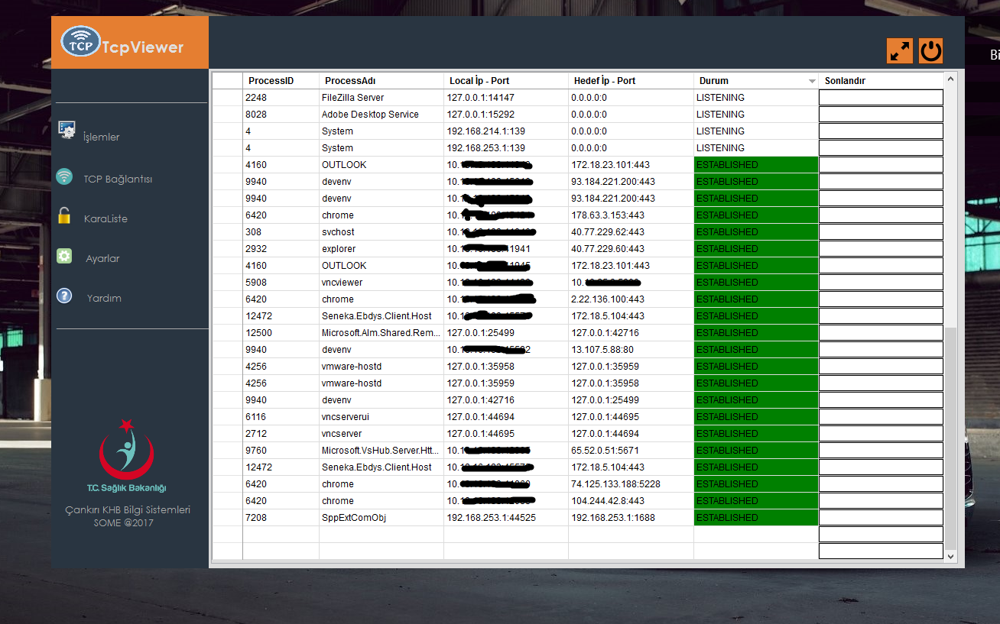

# TcpViewer

is a Windows Client TCP Connections Management And Botnet Server Hosts connection Blocking & Alert System

Application get c&c server host ip adresses from blacklist_hosts.html from a web server... Application lists all process and tcp connections, if detects a connection to the adress on /blacklist_hosts.html , it alerts and send e-mail to system administrator

  
 

